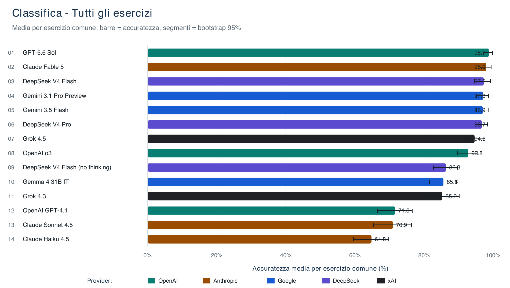

# UniAIBench

**A controlled, auditable benchmark of AI models on advanced university-level
problems in Mathematical Analysis III and General Physics II.**

UniAIBench evaluates complete, open-ended solutions produced through direct
provider APIs under a closed-resource condition: one exercise per request, no
web access, retrieval, code execution, calculators, or external tools. Answers
are assessed with item-specific atomic rubrics, blind judging, deterministic
validation, and versioned human adjudication.

This repository is the publication-oriented release of the project. It contains
the reusable methodology, prompts, schemas, reference harness, sanitized
aggregate results, figure-generation programs, and paper. It deliberately does
not distribute the examination statements, official solutions, completed
item-specific rubrics, model-answer texts, individual judgments, or private
identity maps used in the full research workflow.

UniAIBench is not intended to be a universal LLM leaderboard. It is a focused
study of advanced mathematical and physical reasoning, examined together with
token use, estimated API cost, and end-to-end response time.

[Explore the interactive benchmark](https://uniaibench.org) or read the
[current paper](paper/benchmark_publication.pdf).

## What can you do with this repository?

You can use it to:

- understand a complete evaluation protocol for open-ended technical answers;
- reuse the T1--T8 framework and blank atomic-rubric template in another domain;
- adapt the solver, rubric-builder, judge, and adjudicator prompts;
- inspect a reference multi-provider benchmark harness and configuration model;
- validate rubric, judgment, and configuration artifacts offline;
- study the published 14-configuration by 60-exercise matched comparison;
- reproduce the public correctness, token, cost, and latency figures;
- rebuild the scientific paper from its public sources;
- audit which components are public and which remain in the private archive.

The repository supports methodological reuse and aggregate-result
reproducibility. It does not claim that the private source-to-response pipeline
can be reconstructed from the public release alone.

## Why this benchmark exists

Many mathematical benchmarks reduce evaluation to exact-answer matching or
multiple-choice accuracy. That is insufficient for advanced derivations. A
plausible final number can follow an invalid method, while a locally imperfect
calculation can still preserve substantial correct reasoning.

UniAIBench was designed around four priorities:

1. **Authentic difficulty.** The study uses advanced university examination
   material in mathematical analysis and physics rather than short synthetic
   questions.
2. **Controlled generation.** Every solver receives the same no-tool,
   closed-resource task format through a direct provider API.
3. **Inspectable assessment.** Anonymous answers are evaluated against frozen,
   item-specific atomic rubrics instead of receiving a single opaque score.
4. **Multi-objective reporting.** Correctness is reported together with token
   use, estimated cost, latency, failure modes, and operational validity.

These choices make the benchmark more labor-intensive than answer matching,
but they also make individual scores easier to inspect, contest, and reproduce.

## Current study and release status

This repository represents the **UniAIBench v1.0** publication release.

| Item | Published study |
|---|---:|
| Benchmark snapshot | 14 August 2026 |
| Subjects | 2 |
| Model--mode configurations | 14 |
| Common exercises | 60 |
| Mathematical Analysis III exercises | 33 |
| General Physics II exercises | 27 |
| Matched model--exercise cells | 840 |
| Retained responses summarized by those cells | 924 |

“Model--mode configuration” is used deliberately: two configurations of the
same underlying model can differ in reasoning mode, endpoint, or other recorded
execution settings. Results are therefore attached to the exact configuration
and dated campaign, not only to a product name.

## Evaluation workflow

```text
Define the study scope and freeze the generation contract
                         |
                         v
Select source material and independently verify references
                         |
                         v
Build and freeze an atomic rubric before seeing model answers
                         |
                         v
Generate answers under the same controlled conditions
                         |
                         v
Create anonymous IDs and a permanent private identity map
                         |
                         v
Judge one anonymous answer at a time against the frozen rubric
                         |
                         v
Validate judgments and adjudicate flagged cases without rewriting history
                         |
                         v
Unblind only after validation, then aggregate and report
```

Generation and judgment are separated by design. During generation, the solver
does not receive official solutions, rubrics, other model answers, or external
tools. During blind evaluation, the judge receives one anonymous answer and the
frozen evaluation contract, but not the private model-identity map.

The complete protocol is described in
[Benchmark design](docs/benchmark-design.md),
[Blind judging](docs/blind-judging-protocol.md), and
[Human adjudication](docs/human-adjudication.md).

## How answers are scored: T1--T8

Each exercise receives an item-specific rubric composed of atomic criteria.
Every criterion has an explicit point value and belongs to exactly one primary
dimension. The default 100-point budget is:

| Dimension | General purpose | Points |
|---|---|---:|
| T1 | Problem understanding and formalization | 20 |
| T2 | Method selection and setup | 15 |
| T3 | Mathematical or logical development | 20 |
| T4 | Final result and request coverage | 15 |
| T5 | Domains, units, assumptions, and structural conditions | 10 |
| T6 | Internal consistency and domain plausibility | 8 |
| T7 | Rigorous use of definitions, principles, and theorems | 7 |
| T8 | Independent verification and limiting cases | 5 |

The dimensions are an organizational layer, not an additional holistic score.
The final score is the sum of the awarded atomic criteria, which prevents the
same strength or error from being counted twice. Domain-specific rubrics may
change the individual criteria while preserving the T1--T8 reporting frame.

See the [full dimension guide](docs/t1-t8-framework.md), the
[rubric-authoring guide](docs/rubric-authoring-guide.md), and the
[blank rubric template](rubrics/templates/rubric.template.json).

## What is included and what remains private

| Included in this repository | Kept in the private research archive |
|---|---|
| Methodology, prompts, schemas, and blank rubric template | Examination statements and official solutions |
| Reference harness and generic configuration templates | Completed item-specific rubrics |
| Sanitized model--item score and resource panels | Model-answer text and provider-native payloads |
| Aggregate tables, figures, and all public chart programs | Individual judgments and adjudication records |
| Paper source and compiled paper | Blind inputs and private identity maps |
| Website data exporter and link to the deployed site | Website source, Atlas records, retries, and internal experiments |

This boundary is intentional. Plain-text transcription does not remove the
rights attached to source examination material. The public release therefore
contains provenance information and derived aggregate evidence without serving
as a redistribution channel for the underlying exams.

See [Data provenance](DATA_PROVENANCE.md) and the
[publication manifest](EXPORT_MANIFEST.md) for the exact boundary.

## Repository structure

```text
UniAIBench-public/
|-- docs/                    methodology, protocols, and extension guides
|-- schemas/                 rubric, judgment, and configuration JSON Schemas
|-- rubrics/templates/       blank, unfilled rubric template
|-- prompts/                 solver, rubric, judge, and adjudicator templates
|-- configs/                 generic benchmark configuration templates
|-- tools/                   offline artifact and publication validators
|-- analysis/
|   |-- data/                sanitized score, resource, and model metadata
|   |-- tables/              aggregate rankings and T1--T8 profiles
|   |-- figures/             publication-ready visual summaries
|   `-- scripts/             figure and website-data generators
|-- results/                 secondary aggregate result views
|-- paper/                   manuscript source, figures, and compiled PDF
|-- benchmark_harness.py     multi-provider reference implementation
|-- DATA_PROVENANCE.md       source-material and redistribution boundary
|-- LICENSE.md               component-specific licence scope
`-- CITATION.cff             machine-readable citation metadata
```

The root README is the navigation entry point. Operational details belong in
the linked documents so that the public/private boundary and the executable
instructions remain unambiguous.

## Requirements and first validation

The offline public workflow requires:

- Python 3.11 or later;
- the packages listed in `requirements.txt`;
- Tectonic only when rebuilding the paper;
- provider credentials, network access, and API credit only for explicitly
  authorized real runs.

Create an isolated Python environment from the repository root:

```bash
python3.11 -m venv .venv
.venv/bin/python -m pip install -r requirements.txt
```

Run the complete offline validation gate:

```bash
make check
```

Before a release or visibility change, run the stricter publication gate:

```bash
make check-strict
```

These checks validate schemas, templates, model metadata, aggregate data,
internal links, repository structure, and publication-safety rules. They also
scan for forbidden private-artifact paths, credential patterns, local absolute
paths, completed rubrics, and sensitive CSV headers. They do not replace the
final human review of rights and licence scope.

## Reusing the method in another benchmark

A new benchmark should be built in this order:

1. Define the domain, sampling rule, unit of analysis, execution condition,
   exclusion policy, and reporting metrics.
2. Record the provenance and redistribution status of every source item.
3. Create and freeze each item-specific rubric before any target answer is
   inspected.
4. Freeze the generation prompt and exact model--mode configurations.
5. Generate answers while preserving prompt, normalized answer, provider
   metadata, and raw response as separate artifacts.
6. Assign anonymous IDs and save a permanent private identity map before the
   first judgment.
7. Judge answers independently, validate every judgment, and escalate genuine
   ambiguity to versioned human adjudication.
8. Unblind only after the blind batch is complete, then aggregate matched data
   and state all exclusions explicitly.

The [extension guide](docs/extending-the-method.md) turns these principles into
a practical sequence. The [prompt guide](prompts/README.md) explains what each
role receives and what information must remain hidden.

## Choosing models and roles

The methodology does not require a particular vendor. It separates four roles:

- **solver:** the system whose answer quality and resource use are measured;
- **rubric builder:** a capable structured-output assistant used before target
  answers are visible;
- **blind judge:** a technically competent model that evaluates one anonymous
  answer at a time;
- **adjudication assistant:** optional decision support for cases that remain
  under human authority.

For every role, record the provider, exact model identifier, endpoint, date,
reasoning mode, token limit, sampling settings, and any provider-specific
parameters. Human approval remains mandatory when freezing rubrics and deciding
adjudications.

See [Model selection and operation](docs/model-selection.md). The
[evaluated-model catalog](docs/evaluated-models.md) records the 14 v1.0
configurations, technical specifications, reasoning modes, official links, and
both current and frozen benchmark prices.

## Reference harness

The Python harness contains adapters for OpenAI, Anthropic, Google,
Kimi/Moonshot, DeepSeek, and xAI. It is published as a reference
implementation, not as a turnkey reproduction of the private campaign.

```bash
.venv/bin/python benchmark_harness.py --help
```

Start from
[`configs/benchmark_config.template.json`](configs/benchmark_config.template.json)
or the provider-specific Google template. The templates deliberately keep
`provider_calls_authorized` disabled. A real campaign requires a locally
provided dataset, protected credentials, an inspected offline plan, and a
reviewed one-job smoke test.

Never commit `.env`, API keys, raw provider payloads, or identity maps. Do not
mix outputs produced with different prompts, datasets, models, or execution
settings in the same run directory.

## Published results

The principal comparison uses the same 60 exercises for all 14 configurations.
Its 840 model--exercise cells summarize 924 retained responses because some
cells contain repeated runs.

The top six configurations by mean rubric score were:

| Rank | Configuration | Mean score | 95% item-bootstrap interval |
|---:|---|---:|---:|
| 1 | GPT-5.6 Sol | 98.72% | 97.04--99.86% |
| 2 | Claude Fable 5 | 97.99% | 96.15--99.38% |
| 3 | DeepSeek V4 Flash | 97.24% | 94.66--99.16% |
| 4 | Gemini 3.1 Pro Preview | 97.05% | 95.11--98.60% |
| 5 | Gemini 3.5 Flash | 96.95% | 95.10--98.51% |
| 6 | DeepSeek V4 Pro | 96.71% | 94.76--98.31% |



The overlapping intervals do not justify treating the displayed order as a
set of sharply separated performance tiers. Subject stability, T1--T8 profiles,
token use, estimated cost, response time, and operational failures remain part
of the interpretation. The interactive website makes these trade-offs explicit
instead of presenting a single immutable ranking.

## Results and reproducibility

The public evidence is organized as follows:

- [`analysis/data/`](analysis/data/): sanitized model--item scores, resource
  panels, and canonical model metadata;
- [`analysis/tables/`](analysis/tables/): principal rankings, coverage,
  T1--T8 profiles, and resource summaries;
- [`analysis/figures/`](analysis/figures/): publication-ready figures;
- [`analysis/scripts/`](analysis/scripts/): executable generators for all
  public paper and website chart families;
- [`analysis/FIGURE_PROVENANCE.md`](analysis/FIGURE_PROVENANCE.md): exact
  output-to-program and output-to-input mapping;
- [`results/`](results/): secondary aggregate exam-level views;
- [`paper/`](paper/): manuscript source and compiled PDF.

Rebuild the public figures and generated model documentation with:

```bash
make figures
```

Rebuild the complete public manuscript with:

```bash
make paper
```

The figure programs are part of the release because visual transparency
requires more than distributing final images. Readers must be able to inspect
the input columns, aggregation choices, labels, scales, and transformations
that produced every chart shown in the paper or exported to the website.

Exact answer generation and individual re-judgment require the non-distributed
source artifacts. The public repository therefore supports exact regeneration
of its aggregate views, but only method-level reproduction of the private
source-to-judgment pipeline. See
[Reproducibility boundaries](docs/reproducibility.md).

## Documentation map

Read the detailed documentation in this order:

1. [Benchmark design](docs/benchmark-design.md)
2. [T1--T8 framework](docs/t1-t8-framework.md)
3. [Rubric authoring](docs/rubric-authoring-guide.md)
4. [Model selection and operation](docs/model-selection.md)
5. [Evaluated models and prices](docs/evaluated-models.md)
6. [Blind judging protocol](docs/blind-judging-protocol.md)
7. [Human adjudication](docs/human-adjudication.md)
8. [Reproducibility boundaries](docs/reproducibility.md)
9. [Extending the method](docs/extending-the-method.md)

Supporting entry points:

- [`prompts/README.md`](prompts/README.md): role-specific prompt templates;
- [`configs/README.md`](configs/README.md): configuration templates and safety
  defaults;
- [`analysis/README.md`](analysis/README.md): aggregate-data layout;
- [`paper/README.md`](paper/README.md): manuscript build policy;
- [`PUBLICATION_CHECKLIST.md`](PUBLICATION_CHECKLIST.md): technical, AI-assisted,
  and human publication checks.

## Data and artifact policy

Historical runs, judgments, identity maps, and adjudications are preserved in
the private archive rather than overwritten. Derived reports are tied to
explicit source files and authority rules. No identity is reconstructed from
mathematical content, file order, or score similarity.

The study source material comes from examination material of the University of
Padua. This repository does not distribute the examination statements,
official solutions, source scans, completed rubrics, or response archive. The
licences in this repository apply only to the components expressly covered in
[`LICENSE.md`](LICENSE.md).

## Limitations

- The benchmark covers selected courses and examination sessions; it is not a
  universal measure of mathematical or scientific intelligence.
- Closed-resource execution prevents live retrieval but cannot prove that a
  problem was absent from model training data.
- Proprietary models, endpoints, prices, and provider behavior can change.
  Every result is bound to its recorded identifier, configuration, and date.
- LLM-assisted judging is scalable but not independent of the judging system.
  Frozen rubrics, blind inputs, validation, and human adjudication reduce but do
  not eliminate judge dependence.
- Token categories are not perfectly comparable across providers.
- Estimated cost and observed latency are dated operational measurements, not
  permanent model properties.
- The 60-item panel supports matched comparison within this study, not a claim
  of statistical superiority for every apparent rank difference.
- Public aggregate data cannot reproduce source-level answer generation or
  individual judgments without the protected archive.

## AI-assisted evaluation disclosure

AI judge agents are part of the documented evaluation pipeline. Their outputs
are constrained by frozen specifications and item-level rubrics, validated
centrally, and subject to versioned human review. AI assistance was also used
during parts of repository construction and documentation. Preserved artifacts,
hashes, deterministic validation, and final human authority are used to keep
the process auditable.

## Citation

Machine-readable citation metadata are available in
[`CITATION.cff`](CITATION.cff). Until an archival DOI is available, cite the
v1.0 repository release and accompanying manuscript:

```bibtex
@misc{bortot2026uniaibench,
  author  = {Francesco Bortot},
  title   = {UniAIBench: Benchmarking AI Models on Advanced University-Level Analysis III and Physics II Problems},
  year    = {2026},
  version = {1.0},
  url     = {https://github.com/FrancescoBortot/UniAIBench-public}
}
```

## Licences and contributions

- Software is licensed under the MIT License.
- Original documentation, prompts, schemas, blank templates, aggregate data,
  figures, and paper are licensed under CC BY 4.0.
- Third-party names, trademarks, and non-distributed source material are not
  covered by those grants.

See [`LICENSE.md`](LICENSE.md) for the exact scope and
[`CONTRIBUTING.md`](CONTRIBUTING.md) before proposing a change.

## Author

Francesco Bortot
